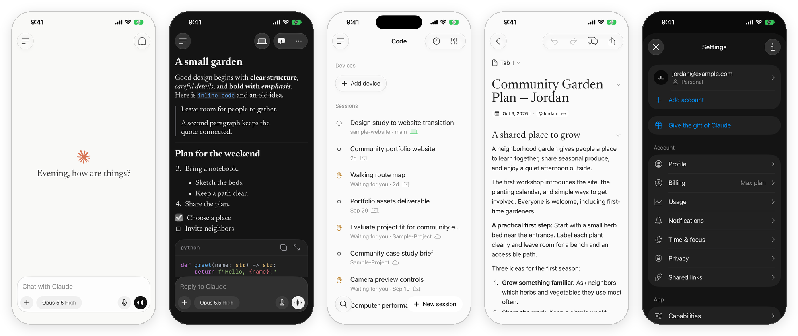
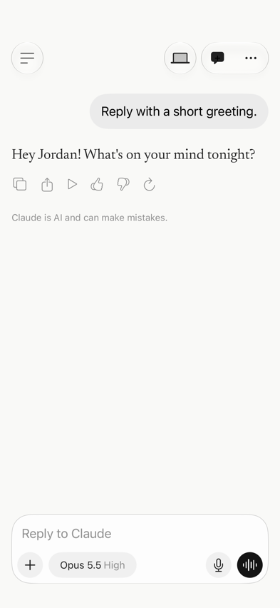
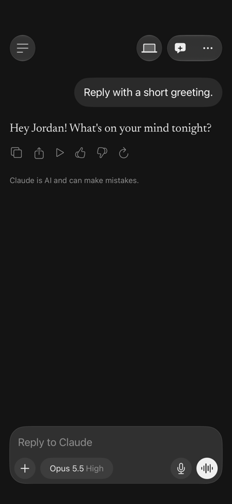

# Claude iOS UI

A reusable SwiftUI UI skeleton inspired by Claude for iPhone. Explore chat, media, rich text and native Liquid Glass controls in an offline demo, then connect your own model and services. Light and dark presentations are included; full app parity is still a work in progress.

[](https://github.com/bryanrg22/claude-ios-ui/actions/workflows/ci.yml)


[](LICENSE)
[](https://github.com/bryanrg22/claude-ios-ui/releases)

<p align="center">
  
</p>

> [!NOTE]
> **Unofficial.** This project is not affiliated with, endorsed by, or sponsored by Anthropic. Claude is a trademark of Anthropic. The recreation follows Claude for iOS version 1.261002.20, observed in October 2026.

[Run the demo](#try-the-demo) · [Integrate](docs/INTEGRATION.md) · [Contribute](CONTRIBUTING.md) · [Report a mismatch](https://github.com/bryanrg22/claude-ios-ui/issues/new/choose)

## Light and dark

<table>
  <tr><th>Light</th><th>Dark</th></tr>
  <tr>
    <td></td>
    <td></td>
  </tr>
</table>

These are screenshots of this project's demo with fictional messages, not captures of the official app. The banner above shows more feature areas. Browse the [screen catalog](Examples/ClaudeUIDemo/Shared/DemoScreen.swift) and [coverage notes](docs/fidelity/ROUTE_COVERAGE.md) for what is implemented, approximate or still TODO.

## What's inside

- **`ClaudeUI`** — SwiftUI views and presentation state for the app: chat and composer, model and effort pickers, dictation, voice mode, camera, photos and video, Markdown with syntax-highlighted code, Settings and its pages, Claude Code (sessions, environments, repositories, connectors, routines), Dispatch, Devices, Projects and Artifacts.
- **`ClaudeWidgets`** — Home Screen widget views with deep links.
- **A demo app** in [`Examples/ClaudeUIDemo`](Examples/ClaudeUIDemo) with fictional data, a real WidgetKit extension, and a `--screen <name>` shortcut that opens any of the 34 catalogued screens directly.
- **Four test suites** — unit, screenshot, UI and accessibility. CI always checks format, project sync, unit tests and the iOS 26 SDK build. Simulator suites run automatically for public repositories; while private, they require a manual Actions run. See [TESTING.md](docs/TESTING.md).

The package draws the interface and keeps presentation state only. It makes no network calls, needs no API keys, and never touches the microphone, camera or photo library: your app supplies all of that.

## Requirements

- Xcode 26.4 or newer (the screenshot references are recorded with Xcode 27.0)
- iOS 26 or newer
- Swift 6.2

## Try the demo

```sh
git clone https://github.com/bryanrg22/claude-ios-ui.git
cd claude-ios-ui
open Examples/ClaudeUIDemo/ClaudeUIDemo.xcodeproj
```

Choose the `ClaudeUIDemo` scheme and an iPhone simulator, then press Run. The first build resolves package dependencies over the network. Running the demo requires no account or API key. For screenshot comparisons, use the exact configuration in [TESTING.md](docs/TESTING.md), rather than any available simulator.

Sending a message streams a canned local reply. To jump to a screen, add a launch argument in the scheme, for example `--screen code` or `--screen settingsPrivacy --light`. Every name is listed in [`Shared/DemoScreen.swift`](Examples/ClaudeUIDemo/Shared/DemoScreen.swift).

## Use it in your app

Add the package in Xcode (**File → Add Package Dependencies…**) with this repository's URL, or in `Package.swift`:

```swift
.package(url: "https://github.com/bryanrg22/claude-ios-ui", from: "0.1.0")
```

Then own a `SessionState`, show `ClaudeSessionView`, and answer the actions it sends you. This example streams a reply from your own backend:

```swift
import ClaudeUI
import SwiftUI

struct ContentView: View {
    @State private var session = SessionState()
    @State private var reply: Task<Void, Never>?

    var body: some View {
        ClaudeSessionView(state: $session) { action in
            session.reduce(action)  // let the UI update itself first
            switch action {
            case .send(let text):
                guard let id = session.responseID else { return }  // set by reduce(.send)
                reply = Task {
                    do {
                        for try await chunk in MyBackend.stream(prompt: text) {  // your API client
                            session.appendResponse(chunk, responseID: id)  // each new piece of text
                        }
                    } catch {
                        session.appendResponse("\n\n(Something went wrong.)", responseID: id)
                    }
                    session.finishResponse(responseID: id)
                }
            case .stop:
                reply?.cancel()
            default:
                break
            }
        }
    }
}
```

## How it works

`SessionState` is a plain value, and a single `reduce(_:)` function applies every user action to it, so the UI's behavior is predictable and easy to test:

```text
user taps ──▶ ClaudeAction ──▶ your handler ──▶ session.reduce(action)   (the UI updates itself)
                                     │
                                     └──▶ your backend ──▶ appendResponse / finishResponse, feature data
```

- **State in.** `SessionState` and its feature states (`session.code`, `session.settings`, `session.projects`, …) hold what the screens show. Set them from your data.
- **Actions out.** Every button that would need a server, a device or the system emits a typed action: send, stop, retry, start dictation, share, connect, save.
- **Stale replies are ignored.** Each request gets an ID. Updates for a stopped or replaced request are dropped, so a slow network can't overwrite a newer answer. Account loads, Dispatch messages and settings saves work the same way.

The [integration guide](docs/INTEGRATION.md) covers every feature area: settings, voice, devices, Dispatch, Code, routines, projects, artifacts, widgets, Markdown, media, camera and dictation.

## What's covered

| Area | Status |
|---|---|
| Chat, composer, editing, feedback, sidebar | ✅ Built |
| Model and effort pickers, dictation, voice mode | ✅ Built (silent; no audio) |
| Camera, photos, image and video viewers | ✅ Built (your app supplies the media) |
| Markdown, syntax-highlighted code, tables | ✅ Built |
| Settings: profile, notifications, time & focus, privacy, usage, billing, shared links, capabilities, memory, Claude Code, connectors | ✅ Built; About, Account, Gift, Permissions and Voice pages are placeholders |
| Claude Code: sessions, new session, environments, repositories, branches, connectors, routines | ✅ Built |
| Dispatch, Devices, Projects, Artifacts, feature announcement | ✅ Built; some populated and detail states not yet captured |
| Home Screen widgets | ✅ Built as a real WidgetKit extension |
| Customize, Lock Screen, Live Activities, Dynamic Island | ⬜ Not yet |

The full record of what was captured from the real app, and how closely each screen matches it, is in [docs/fidelity](docs/fidelity/ROUTE_COVERAGE.md).

## Project layout

```text
Sources/ClaudeUI/           The interface: views and presentation state
Sources/ClaudeWidgets/      Widget views and deep links
Tests/ClaudeUITests/        Unit tests (run on the Mac with `swift test`)
Examples/ClaudeUIDemo/      Demo app, widget extension, screenshot and UI tests
docs/                       Integration guide, feature guides, fidelity records
```

## Help keep it current

- **Found a visual mismatch?** [Open a mismatch report](https://github.com/bryanrg22/claude-ios-ui/issues/new?template=1-ui-mismatch.yml) with the route, reproduction steps, app version, device/iOS, appearance and a reference screenshot or video.
- **The real app changed?** [Suggest an update](https://github.com/bryanrg22/claude-ios-ui/issues/new?template=2-app-update.yml). Keep one screen or flow per issue.
- **Something crashes or fails to build?** [Report a bug](https://github.com/bryanrg22/claude-ios-ui/issues/new?template=3-bug.yml) with a minimal reproduction and logs.
- **Want to fix it?** Read [CONTRIBUTING.md](CONTRIBUTING.md). A visual PR includes **reference → before → after** evidence in both appearances where applicable. Motion changes need recordings and measured timing; CI screenshots alone cannot verify motion or official-app parity.

The maintainer compares the evidence, checks the test results, and reviews the code before approving a PR. [The review guide](docs/REVIEW_GUIDE.md) explains the acceptance checklist and how to review screenshot updates. Keep all reference captures free of personal information.

Looking for the other skeleton? [ChatGPT iOS UI](https://github.com/bryanrg22/chatgpt-ios-ui).

## License

The source code is available under the [MIT License](LICENSE). Bundled fonts, artwork and dependencies keep their own terms; see [THIRD_PARTY.md](THIRD_PARTY_NOTICES.md).
